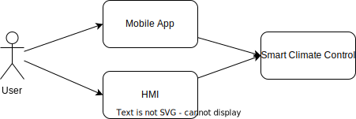

# Business Context

* User - End-user of the vehicle, Driver or Passenger;
* Mobile App - application on User's smartphone, which is connected to the vehicle;
* HMI - Human-Machine Interface used to control vehicle systems;
* Smart Climate Control - vehicle system, the main subject of the document.
