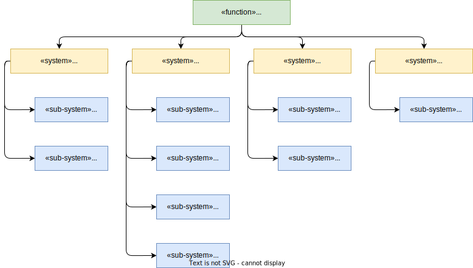

# Functional View

## Functional Decomposition

- User Interaction
    - Application -- mobile application features to provide SCC control interface
    - HMI -- vehicle's head unit features to provide SCC control interface
- Climate Manager
    - Humidity mode -- features to implement humidity-based auto control
    - Temperature mode -- features to implement temperature-based auto control
    - Combined mode -- features to implement combined temperature and humidity auto control based on euristics on average sensing
    - Personalized mode -- features to implement historical data based mode for exact end-user
- Sensors
    - Temperature
    - Humidity
- Air Conditioner
    - Actuator

## Requirements

### SYS_SCC_REQ_001
Type: FR
Status: Draft
ASIL: QM
Verification Criteria: Smart Climate Control changes its working mode on mobile application control command.
Rationale: It is cool and smart

Smart Climate Control System shall support Mobile Application as controller of the function.

### SYS_SCC_REQ_002
Type: FR
Status: Draft

Smart Climate Control System shall support Apple CarPlay as controller protocol of the function.

### SYS_SCC_REQ_003
Type: FR
Status: Draft

Smart Climate Control System shall support Android Auto as controller protocol of the function.

### SYS_SCC_REQ_004
Type: FR
Status: Draft

Smart Climate Control System shall support ATOM BT+Wi-Fi as controller protocol of the function.

### SYS_SCC_REQ_005
Type: FR
Status: Draft

Smart Climate Control System shall support ATOM HMI as controller of the function.

### SYS_SCC_REQ_006
Type: FR
Status: Draft

Smart Climate Control System shall support ATOM com as controller protocol of the function between ECUs.

### SYS_SCC_REQ_007
Type: FR
Status: Draft

Smart Climate Control System shall provide climate-related data:
- Current temperature, Celsius
- Current humidity, %

### SYS_SCC_REQ_008
Type: FR
Status: Draft

Smart Climate Control System shall main temperature, which was requested by end user.

### SYS_SCC_REQ_009
Type: FR
Status: Draft

Smart Climate Control System shall main temperature, which was requested by end user.

### SYS_SCC_REQ_010
Type: FR
Status: Draft

Smart Climate Control System shall provide a way to enable personalized climate control mode.

### SYS_SCC_REQ_011
Type: FR
Status: Draft

Personalized climate control mode shall predict desired by end user temperature and humidity based on historical data, including:
- Temperature inside vehicle
- Humidity inside vehicle
- Teperature outside vehicle

### SYS_SCC_REQ_012
Type: FR
Status: Draft

While personilized climate control mode is enabled, every change of the target in-vehicle temperature shall be stored for further analysis of end user preferences.

### SYS_SCC_REQ_013
Type: FR
Status: Draft

While personilized climate control mode is enabled, every change of the target in-vehicle humidity shall be stored for further analysis of end user preferences.

### SYS_SCC_REQ_014
Type: FR
Status: Draft

Smart Climate Control System shall provide a way to disable personalized climate control mode.

### SYS_SCC_REQ_015
Type: FR
Status: Draft

Smart Climate Control System shall support separate control for driver's zone.

### SYS_SCC_REQ_016
Type: FR
Status: Draft

Smart Climate Control System shall support separate control for front passenger's zone.

### SYS_SCC_REQ_017
Type: FR
Status: Draft

Smart Climate Control System shall support separate control for rear passengers' zone.

### SYS_SCC_REQ_018
Type: FR
Status: Draft

Smart Climate Control System shall support centrilized synchronized control for all zones.

### SYS_SCC_REQ_XXX
Type: FR || NFR
Status: Draft || Accepted
ASIL: QM || A || B || C || D - out of scope for the document
Verification Criteria: criteria
Rationale: rationale

Requirement summary
