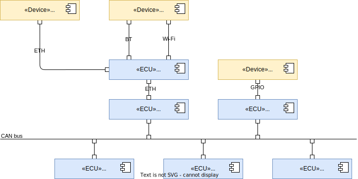
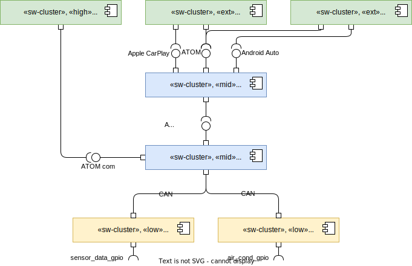

# Building Block View

## Hardware Building Block View

- `HMI` -- head unit device which provides GUI
- `Smartphone` -- end user's smartphone device which is connected to the car
- `com_gateway` -- communication gateway ECU, which provides a layer of communication of in-vehicle systems to outside
- `infotainment_master` -- main board of infotainment-related services
- `non_safety_actuator` -- ECU which connects to in-vehicle device in order to execute received commands
- `zone_<ZONE>` -- zone controllers which contains sensors

## Software Building Block View

Stereotypes:
- `«sw-cluster»` -- Software Cluster is a set of software components which are grouped by functionality
- `«ext»` -- External is a stereotype to highlight that SW Cluster is supposed to be implemented off-vehicle
- `«low»` -- bare-metal or deeply embedded software
- `«mid»` -- middleware software to provide common functionality to different SW Clusters
- `«high»` -- in-vehicle software which is close to end-user interaction

SW components:
- `climate_control_hmi_service` -- works with GUI to provide end user with control and monitoring interface
- `ios_app` -- might work via ATOM interface or Apple CarPlay
- `android_app` -- might work via ATOM interface or Android Auto
- `communication_management` -- provides multiple ports to communication to outside world, e.g. BT, Wi-Fi, V2X, HTTPS
- `climate_control_services` -- processes control signals from end user and implements deduction of needed action signal to be sent to actuator
- `sensor_data_collector` -- collects sensor data, packs it into CAN packets and sends it to the network
- `air_conditioner_actuator` -- accepts control signals from CAN network and sends action signals to air conditioning device

Interfaces:
- `Apple CarPlay`
- `Android Auto`
- `ATOM BT+Wi-Fi` -- internal protocol to communicate with Smartphones. BT for pairing, Wi-Fi for data transfer.
- `ATOM com` -- internal in-vehicle communication protocol commonly used across in-vehicle ECU network, might be `some/ip`, `protobuf` or `rsocket` based.
    - `ClimateControlService`
        - climate_data: ClimateData
            - Type: `Field`
            - Fields: `humidity: uint8, temperature: int8`
        - set_temperature(zone: Zone, temp: uint8): void
            - Type: `method`
            - Param `temp: uint8` - 16 -- 28, degrees C
        - set_humidity(zone: Zone, humidity: uint8): void
            - Type: `method`
            - Param `humidity: uint8` - 30 -- 80, %
        - set_fan_speed_level(zone: Zone, level: uint8): void
            - Type: `method`
            - Param `level: uint8` - 0 -- 32, level
        - personilized_mode(zone: Zone, on: bool): void
            - Type: `method`
            - Param `on: boolean` - `True` if user enables the mode, `False` otherwise
        - ClimateData
            - Type: `DataType`
            - Fields
                - `humidity: uint8` - 0 -- 100 %
                - `temperature: int8` - 0 -- 100, -30 -- 70 degrees C
        - Zone
            - Type: `Enumeration`
            - Values
                - `FRONT_LEFT = 0x01`
                - `FRONT_RIGHT = 0x02`
                - `REAR = 0x03`
                - `UNDEFINED = 0x00`
- `CAN`
    - sensor_temp_humid
        - ID: `00100101`
        - Length: `3 bytes`
        - Payload:
            - `<options, 2 bits>`: 0x01 - front_left, ...
            - `<humiduty, 1 byte>`: 0 -- 100%
            - `<temp, 1 byte>`: 0 -- 100, -30 -- 70 degrees C
    - actuator_control_climate
        - ID: `00100100` -- higher priority
        - Length: `2 bytes`
        - Payload:
            - `<options, 6 bit>`: 0 - 32, fan speed level
            - `<options, 2 bits>`: 0x01 - front_left, ...
            - `<temp, 1 byte>`: 0 -- 100, -30 -- 70 degrees C
- `sensor_data_gpio` -- device-specific protocol used to provide sensor data.
- `air_cond_gpio` -- device-specific protocol used to control air conditioning device.

